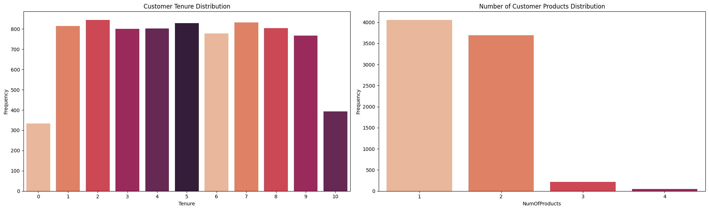
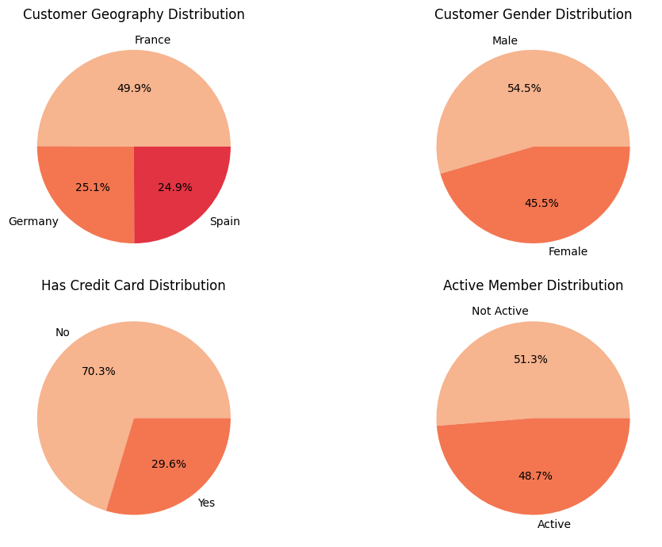
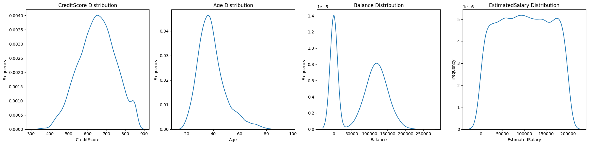
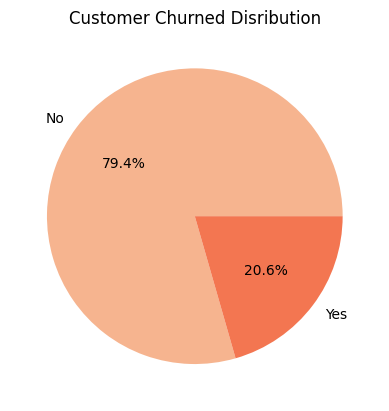
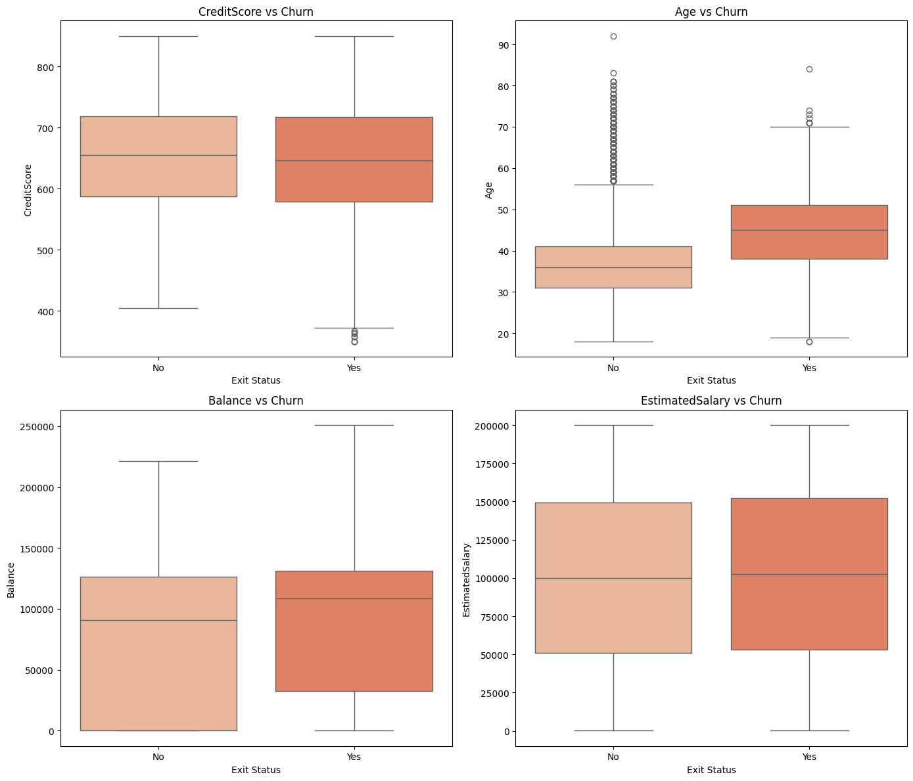

# Credit Attrition Prediction 💸💸

## Project Background

Customer churn poses a significant challenge for businesses, particularly in the banking industry, where maintaining long-term client relationships is crucial for growth and profitability. By analyzing customer credit behavior and related attributes, financial institutions can identify clients likely to leave and take proactive measures to improve retention and mitigate risks.

## Problem Statement

This project focuses on predicting customer churn using a Support Vector Classifier (SVC). Through this analysis, the aim is to pinpoint key factors contributing to churn and leverage predictive modeling to minimize attrition in the financial services sector.

## Goals

- To analyze patterns in customer credit behaviour trends.
- To identify key factors influencing customer churn in credit-related services.
- To build a predictive model to identify at-risk customers.

## Objective

To support the development of targeted strategies that address churn risks, enhance customer satisfaction, and ensure sustainable client relationships in credit services.

## Dataset

The dataset used for this project is a dummy [Churn Dataset](data/credit_churn_data.xls)

## Data Dictionary

- **RowNumber:** Unique identifier for each row, indicating the order in the dataset
- **CustomerId:** Unique identifier for each customer
- **Surname:** Customer's last name
- **CreditScore:** Customer's credit score, representing their creditworthiness
- **Geography:** Customer's geographic location (e.g., country, region)
- **Gender:** Customer's gender (Male/Female)
- **Age:** Customer's age in years
- **Tenure:** Number of years the customer has been with the bank
- **Balance:** Customer's bank account balance
- **NumOfProducts:** Number of products the customer holds with the bank
- **HasCrCard:** Whether the customer has a credit card (1 = Yes, 0 = No)
- **IsActiveMember:** Whether the customer is an active member of the bank (1 = Active, 0 = Inactive)
- **EstimatedSalary:** Customer's estimated annual salary

## Target

- **Exited:** Customer churn status (1 = Exited, 0 = Retained)

## Exploratory Data Analysis
(Train Data Analysis)

### Categorical Data Distribution

**Insights:** 
- Tenure is normally distributed, with the majority of customers staying with the bank for 1 to 9 years.
- Most customers own 1/2 products with the bank.
- Most customers came from France, followed by Germany and Spain.
- Most customers do NOT own a credit card.
- The number of active and non active customers are proportionally distributed.

### Numerical Data Distribution

**Insights:**
- The distribution of credit scores is slightly skewed to the right, meaning more customers have higher credit scores (closer to 800). This could indicate that most customers have a good credit history.
 - The age distribution is concentrated around 30–50 years, with fewer customers in the older age range. This suggests that most customers are middle-aged, which might be relevant depending on the bank’s target demographic.
- A bimodal distribution in the Balance column suggests two distinct customer segments:
	- Low-balance customers who may be more likely to churn.
	- High-balance customers who are likely more engaged and loyal.
- The uniform distribution shows that bank customers has a wide range of salary range.

### Churn Distribution

**Insight:** The majority of customers (79.4%) did not churn, indicating the bank is doing well.

**Insight:** There is a clear difference in median Age and Balance for customers who have churned and those who do not. Those who churned are older in Age and has a higher bank Balance.

## Data Pre-Processing

1. Data Wrangling involved data cleaning such as fixing data quality (types, duplicates, and missing). However, there were no duplicated or missing data in the data dummy.
2. Feature Selection and Engineering involved:
- Dropping unnecessary columns such as `RowNumber`, `CustomerId`,  and `Surname` as they do not contribute to the data prediction
- Encoding the categorical variables (`Geography` , `Gender`)
3. The data was then split into 80% train: 20% test ratio for modelling
4. The train dataset were also checked:
- Outliers were removed using log transformation.
- Robust scaler was used to standardized the data

## Modelling

The model used is Support Vector Machine Classifier (SVC) with grid search cross validation.

## Evaluation

The model performs well in identifying customers who did NOT Churn, with high precision (88%) and recall (96%) for this class. However, it struggles to predict Churn (Exit) customers, achieving only 47% recall, meaning it misses more than half of the actual churn cases. The F1-score for Churn (0.57) indicates that there is a significant imbalance in the model’s effectiveness across classes. The overall accuracy is 86%, but this is skewed by the high accuracy in predicting non-churn cases. Overall, the model is biased towards predicting "Not Churn."

**Recommendation:**

We can consider handling the imbalanced data by applying resampling techniques (e.g., SMOTE). We can also try to implement a more advanced model (e.g., ensemble methods like XGBoost) to improve recall and F1-score for Churn.

## Features Importances

This shows that `Age` as the most influential factor in predicting outcomes, followed closely by the `NumberOfProducts` a customer holds and their account `Balance`. Being an Active Member and the customer's Geography also significantly impact predictions, indicating the importance of demographic and behavioral factors. In contrast, features such as Credit Score, Gender, and Estimated Salary have minimal or even negative importance, suggesting they contribute little to the model's performance. These insights help prioritize factors for targeted strategies in customer management.

## Recommendations

1. **Target Older Customers:** Since age is the most influential factor, develop tailored retention strategies for older customers, such as loyalty programs or personalized financial advice.
2. **Enhance Product Offerings:** Focus on promoting products that meet customer needs, as the number of products strongly influences churn. Encourage customers to engage with additional services to strengthen loyalty.
3. **Prioritize High-Balance Customers:** Allocate resources to retain customers with higher account balances by offering exclusive benefits, as they represent valuable segments with a significant impact on churn.

## Thank You 🙌
